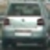
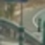
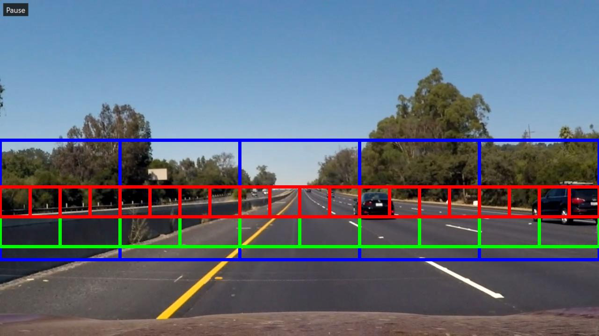
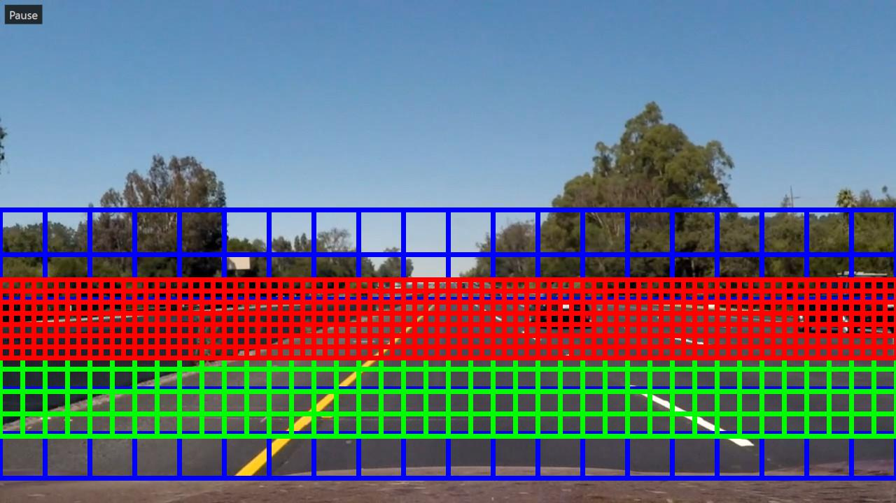
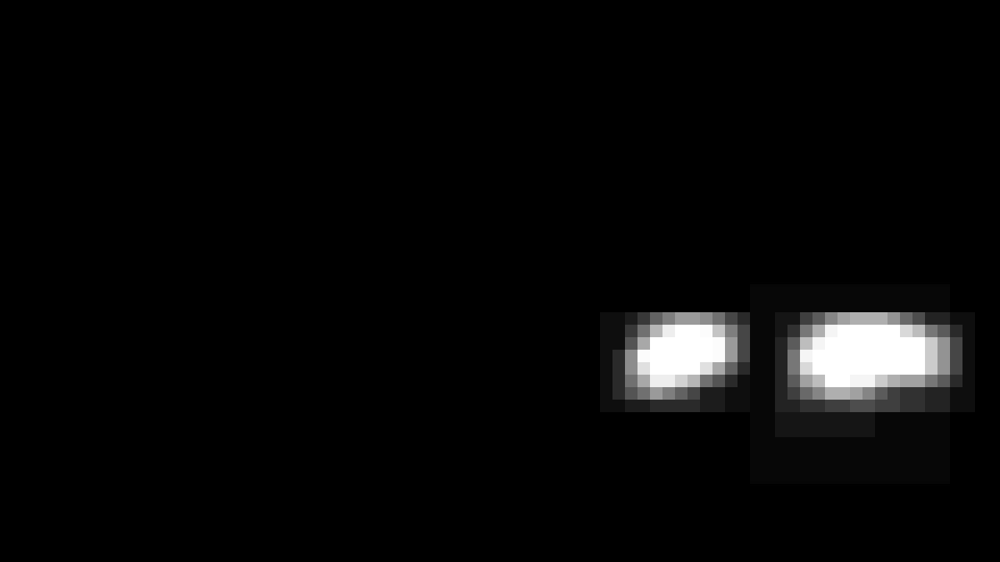
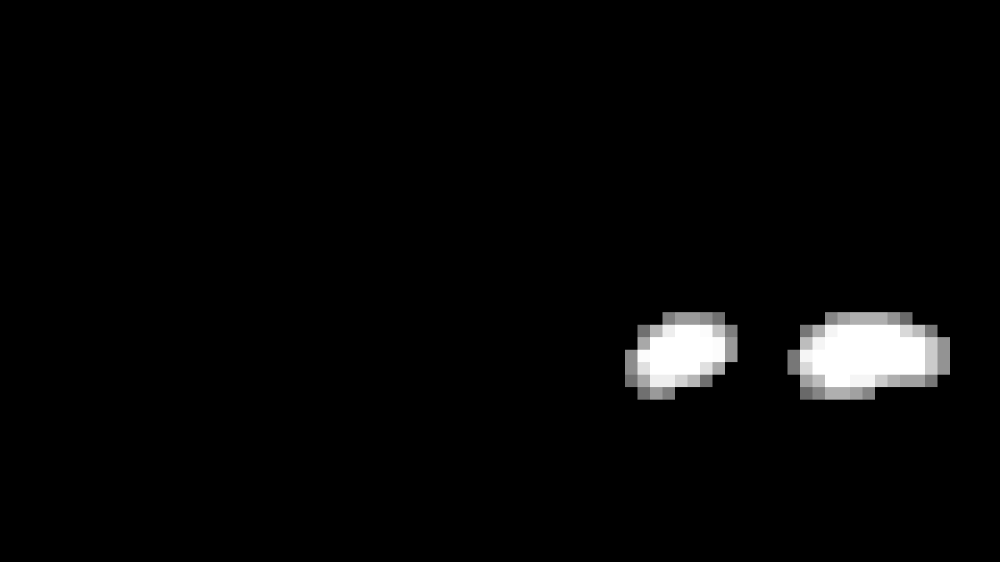
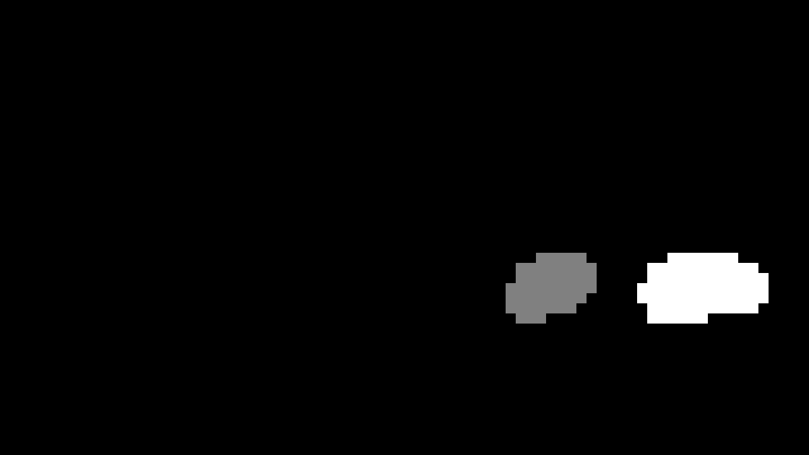
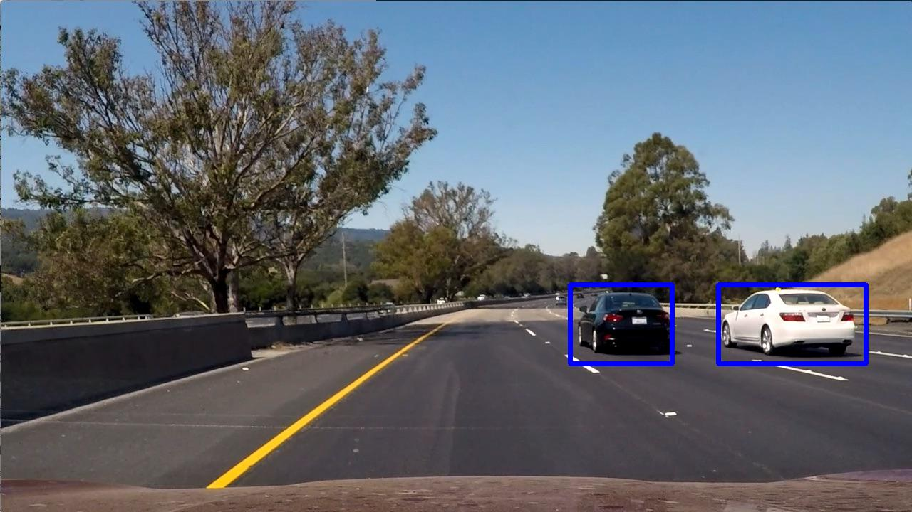

# Vehicle Detection and Tracking
The goal of this project was to implement a pipeline for detecting vehicles in a video stream and to draw bounding boxes around them.

## The pipeline
I decided to go for the machine learning approach, as this is the state of the art way to tackle such kind of problems. The pipeline consists of the following steps:

### 1. Setup
- Create Keras model
- Load training images
- Train the model
- Save the model

If the model has been created already, the saved model will be loaded instead of executing these steps. I used the same model that I already used for the Behavioral Cloning project, except the cropping layer had to be removed and the input size changed. I used the Adam optimizer, a validation split of 0.2, shuffling and trained for 5 epochs. The training images are the ones provided for this project.

|Layer        |Description                                                |
| ----------- | --------------------------------------------------------- |
|Lambda       | Input: 64x64x3, Normalizes the images from -0.5 to 0.5    |
|Convolution2D| Filters: 24, Kernel: 5x5, Subsample: 2x2, Activation: Relu|
|Convolution2D| Filters: 36, Kernel: 5x5, Subsample: 2x2, Activation: Relu|
|Convolution2D| Filters: 48, Kernel: 5x5, Subsample: 2x2, Activation: Relu|
|Dropout      | Keeping probability: 0.5                                  |
|Convolution2D| Filters: 64, Kernel: 3x3, Activation: Relu                |
|Convolution2D| Filters: 64, Kernel: 3x3, Activation: Relu                |
|Dropout      | Keeping probability: 0.5                                  |
|Flatten      | Flattens the data to a one-dimensional array              |
|Dense        | Output: 100                                               |
|Dense        | Output: 50                                                |
|Dense        | Output: 10                                                |
|Dense        | Output: 1                                                 |

Below you can see example images from the training data set. A car (left) and a non-car (right) are shown.

### 2. Image processing
Each image of the video stream will be processed by the following algorithm:
- Get bounding boxes for sliding windows (only once)
- Use sliding windows to get excerpts from the image
- Scale those excerpts to fit the model input size
- Let the model predict if the input either displays a car or not
- If the model predicts a car, an image-sized heatmap is increased at the area of the excerpt
- This is repeated for a certain amount of frames, the heatmap status is not being reset inbetween
- The heatmap is thresholded in order to filter for the "hot" spots that depict cars
- scipy is used to create labels for the distinct cars
- Bounding boxes are being drawn around the labels
- The image is fed to the output video stream

The very first step is to create the bounding boxes for the sliding windows. This has to be done only once. I created multiple sizes of windows for different regions of the car's field of view. The lower parts of the image will be scanned by bigger sliding windows, the parts more far away by smaller windows (due to perspective the cars will be smaller there). The overlapping amounts to 0.75 for each type of window. Below you can see two images that visualize the sliding windows. The first one shows all three window sizes without overlapping, the second one shows the same, but with overlapping.

The input video stream is opened and each image is passed to an image processing step before writing to the output video, in order to detect vehicles. The created windows are being used to get excerpts from the source image. They get resized to 64x64 to satisfy the model input size, the model will then tell if the input shows a car or not. If it is at least 75% sure that it is a car, a beforehand created heatmap will be increased at that particular position. In doing so, the smaller windows will contribute more to the heatmap than bigger ones. This is necessary because cars that will be detected by the bigger windows will also most probably be detected by the smaller windows. Thus, the magnitudes of the hot spots on the heatmap would significantly differ for cars that are near and for cars that are far away. But a similar magnitude is required for the thresholding step. To filter out outliers, 7 frames are added up into the heatmap before evaluating for cars. The next task is to threshold the heatmap to sharpen the hot spots. Then, scipy's label function is used to create labels (i.e. cars) from the heatmap. As the heatmap is of same size as the original image, the labels' bounding boxes can be directly used to draw onto the image. Below you can see an example image, the next images show the heatmap after 7 frames, the thresholded heatmap, the labels and finally the drawn bounding boxes onto the input image.

## Results

## Conclusion
